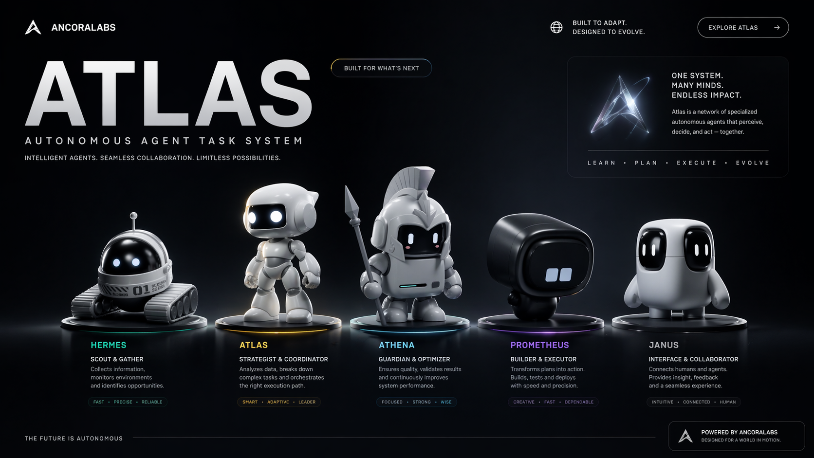

	

# ATLAS

ATLAS is an orchestration runtime framework for autonomous software delivery operations.
It should not be interpreted as a single-command automation utility; rather, it is a
multi-role operational system that performs state interpretation, planning, execution,
observability, and iterative self-optimization within a governed cycle model.

At its operational core, ATLAS performs the following functions:

- Ingests and normalizes system state.
- Routes work packages to role-appropriate execution units.
- Assesses outcome quality against explicit evaluation criteria.
- Persists execution artifacts and decision traces.
- Applies cycle-over-cycle corrective and optimization logic.

## Development Status

ATLAS is currently under active development.

This implies the following:

- Architectural boundaries and worker behaviors remain subject to controlled evolution.
- Selected decision mechanisms are recalibrated at regular intervals.
- The system is explicitly designed to increase capability, reliability, and safety on a per-cycle basis.

In practical terms, this repository should be viewed less as a finalized product showcase
and more as a continuously operating R&D environment.

## The Agent Roster

### Leadership Layer

**Jesus** — CEO Supervisor  
Maintains strategic direction and adjudicates high-impact prioritization decisions.
Interprets cycle state, constrains escalation growth, and enforces directional coherence
to prevent strategic drift across autonomous cycles.

**Prometheus** — Evolution Architect  
Performs deep repository analysis to identify self-improvement opportunities and
produces a structured, dependency-aware execution plan. Balances advancement pressure
against implementation feasibility and consolidation requirements.

**Athena** — Reviewer  
Executes adversarial review of plans and implementations, validates assumptions,
and functions as a quality and governance gate prior to major progression events.

---

### Research Layer

**Research Scout** — Knowledge Hunter  
Conducts structured open-internet reconnaissance for high-value technical knowledge,
emerging patterns, and implementation-relevant practices for autonomous agent systems.
Returns raw research artifacts for downstream synthesis.

**Research Synthesizer** — Knowledge Organizer  
Transforms Scout artifacts into topic-organized, decision-ready synthesis outputs.
Reduces informational noise, preserves high-signal findings, and supplies planning
layers with higher-quality strategic inputs.

---

### Worker Layer

**Evolution Worker** — Codebase Improver  
Focuses on runtime evolution, refactoring, and structural capability improvements
across core system components.

**quality-worker** — Test Specialist  
Owns verification depth, behavioral validation, and regression prevention.
Treats passing checks as a baseline control, not as final evidence of adequacy.

**governance-worker** — Policy Enforcer  
Enforces policy conformance, state governance, and auditability requirements.
Maintains traceable decision lineage and record integrity as a discipline backbone.

**infrastructure-worker** — Foundation Layer  
Handles orchestration plumbing, deployment pathways, containerized runtime
infrastructure, and operational continuity mechanics.

**integration-worker** — Connector  
Coordinates inter-component compatibility and validates communication reliability
across subsystem boundaries.

**observation-worker** — Signal Collector  
Collects telemetry, health indicators, and runtime signals, then performs anomaly
detection and early warning escalation when pattern behavior deviates.

---

## ATLAS Mindset

ATLAS is ambitious not because it is static or flawless, but because it is capable
of institutional learning under iterative constraints.
Its objective is not one-shot perfection; its objective is progressive gains in
robustness, intelligence, and autonomy across successive operational cycles.

## ATLAS Desktop Shell

ATLAS now launches inside a native Electron window instead of opening a localhost page in the default browser. The desktop shell keeps the root workspace route authoritative, stores a session-bound workspace brief under `state\atlas\desktop_sessions\`, and reopens the same live workspace window instead of presenting a separate startup product mode. Repeat launches reuse the same desktop instance, restore the existing window, and keep the last session, workspace draft, and window bounds beside the packaged app.

Use `ATLAS.cmd start` or `npm run atlas:open` to launch the desktop shell, `npm run atlas:desktop:build` to transpile the Electron entrypoints, and `ATLAS.cmd package` or `npm run atlas:desktop:package` to emit a portable Windows app folder with the root executable at `dist\ATLAS\ATLAS.exe`.

