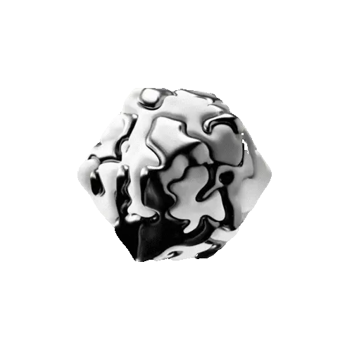
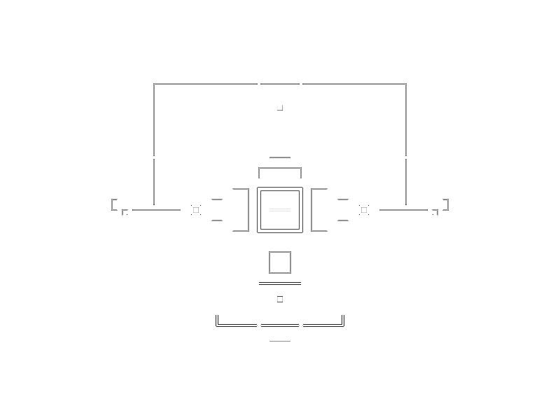

	

# BOX

BOX is an orchestration runtime designed for autonomous software delivery.
It is not a simple one-command script; it is a multi-role operating model
that decides, plans, executes, observes, and attempts to improve itself.

At its core, BOX does this:

- Reads system state.
- Distributes tasks to the right roles.
- Evaluates outputs.
- Records what happened.
- Tries to perform better in the next cycle.

## Development Status

BOX is in active development.

That means:

- The architecture and worker behaviors are still evolving.
- Some decision mechanisms are calibrated frequently.
- The system aims to become a bit smarter and a bit safer every cycle.

In short: this is less a "finished product" showroom and more a live R&D lab.

## The Agent Roster

### Leadership Layer

**Jesus** — CEO Supervisor  
Maintains the high-level strategy and makes critical decisions about what BOX should focus on next. Reads the cycle state, keeps escalations in check, and ensures the system doesn't wander too far off track.

**Prometheus** — Evolution Architect  
Deep-dives into the codebase, analyzes what BOX could improve about itself, and produces a structured plan. Balances ambition with feasibility; knows when to push forward and when to consolidate.

**Athena** — Reviewer  
Reviews plans and implementations with a critical eye. Questions assumptions, validates logic, and acts as the quality gate before major decisions move forward.

	

### Research Layer

**Research Scout** — Knowledge Hunter  
Searches the open internet for cutting-edge technical insights, best practices, and emerging patterns relevant to autonomous agent systems. Brings raw findings back to the team.

**Research Synthesizer** — Knowledge Organizer  
Takes the Scout's raw findings and transforms them into structured, actionable insights. Distills noise into signal so the planning layer has high-quality input for decision-making.

	

### Worker Layer

**Evolution Worker** — Codebase Improver  
Focuses on runtime evolution, refactoring, and core system improvements. Tends to suggest "we can do this better" and is usually right about it.

**quality-worker** — Test Specialist  
Ensures test coverage, validates behavior, and pushes back on untested changes. Takes quality seriously; sees green checks as a starting point, not an end.

**governance-worker** — Policy Enforcer  
Manages state governance, audit trails, and compliance with system policies. Keeps records clean and decisions traceable; the discipline backbone of the system.

**infrastructure-worker** — Foundation Layer  
Handles orchestration, deployment, containerization, and the runtime infrastructure. Works quietly most of the time; deeply missed when something breaks.

**integration-worker** — Connector  
Bridges separate components and ensures they communicate reliably. If it says "these two systems work together," you can trust it.

**observation-worker** — Signal Collector  
Gathers metrics, health signals, and system telemetry. Detects anomalies and raises flags when patterns shift. Tends to be right.

	

## BOX Mindset

BOX is ambitious not because it is flawless, but because it can learn.
Its goal is not to be perfect in one shot, but to become more robust,
more intelligent, and more autonomous with each cycle.

